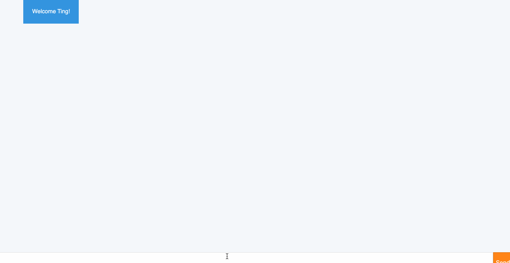

## ChatBot
This is a chatbot engine that handles conversational interactions. It manages the complexity of natural language and controls the lifecycle of a user's interaction with the chatbox. 

This engine is essentially a webserver that interacts with this [messenger UI](http://hipmunk.github.io/hipproblems/lessenger/).

The shared API betweeen the Frontend and the Backend is detailed [here](https://github.com/Hipmunk/hipproblems/blob/master/lessenger/api.md).



For additional notes I wrote on this challenge, see this [GoogleDoc](https://docs.google.com/document/d/1W5P2cfaD_CKF5vIuzAhhq2gaSftE2WU13imUsKgqNRQ/edit#)

Created on May 2018.

### Features
#### Welcome Message

When the user joins a chat with your bot, it responds with a personalized greeting. Example:
```
Hello, Ting!
```

#### Weather

Users are fascinated by the weather. The chatbot includes a weather reporting capability.

The engine handles the following cases:

Note: `<Location>` can be any city or reference to a city such as `SF` or `San Francisco`, or `94100`.

**Current Weather:**

If the user enters one of:
* `what's the weather in <Location>`
* `weather in <Location>`
* `<Location> weather`

Respond with the current weather. Example:
```
Currently it's 48F. Rain
```

#### CORS
The chatbot also addresses the cross-domain nature of the messenger by using a CORS mechanism on your webserver.

In order to allow cross-origin requests from the UI (the UI is served by github and the chatbot server will be on a different domain, localhost:9000), the route exposed is set up to use a CORS mechanism.

CORS allows servers to specify who/ what can access endpoint directly. So with it, a browser can get input from other servers, mash it up as it needs, because of the headers.

```
app.use(function(req, res, next) {
    res.header("Access-Control-Allow-Origin", "*");
    res.header("Access-Control-Allow-Headers", "Origin, X-Requested-With, Content-Type, Accept");
    next();
});
```

### Tech Stack
**Frontend:** [Messenger UI](http://hipmunk.github.io/hipproblems/lessenger/) (already provided)

```
The Messenger UI is a minimalist browser-based bot UI that is capable of communicating with a bot engine.

The UI is a webapp expects a server implementing its API to be available at localhost:9000 (i.e., your development machine). The server should expose following HTTP route:

POST /chat/messages - a route capable of receiving messages, and optionally replying with a response.
```

**Backend:** Node
* uses `body-parser` 
* uses `multer` middleware for handling `multipart/form-data`
* handles post requests to `chat/messages`
* uses CORS

**APIs:**
* The DarkSky Forecast API https://darksky.net/dev/docs/forecast accepts a coordinate point and provides current weather and a forecast.
* The Google Gecoding API https://developers.google.com/maps/documentation/geocoding/start will help you convert arbitrary strings that describe locations to coordinate points. (hint: the query param `address` doesn't need to be a fully formed address).

### To Run:
`yarn install`
`yarn start`

### Architecture
**app.js**
The entry point for our chatbot server. Handles CORs

**request-handler.js**
looks at the request that is received, and checks its `req.body.action`. 

If the action is `join`, then we generate a welcome message.

If the action is `message`, we parse the message to see if it is asking about the weather. if it is, generate a response to indicate the current weather.

Otherwise, return a generic message indicating that the chatbot doesn't understand.

**message-parser.js**
creates an array of all the words in the message. Checks if the text includes the word "weather". If it does, it tries to isolate the address by removing the FILLER_WORDS (eg. what's, is, in, the);

**message-generator.js**
returns a dictionary of responses. currently there are 3 different responses: welcome, weather, and unprocessable. 

This returns a read-friendly message.

**api-keys.js**
holds the api keys for DarkSky and Google Geocoding APIs

**external-apis.js**
holds functions that make external api calls
1. `getWeather(coordinates)`: calls DarkSky API with coordinates and returns the weather data
2. `getGeocode(address)`: calls Google Geocoding API with address and returns coordinates (lat/ long)


### Improvements
- Use more sophisticated [NLP](https://en.wikipedia.org/wiki/Natural_language_processing) or [NLU](https://en.wikipedia.org/wiki/Natural_language_understanding) services/packages to solve this problem.
- Be able to handle punctuations 
- Be able to respond to "what is the weather in <X Location>". Currently, it says "Currently, it is <temperature in X Location>"


