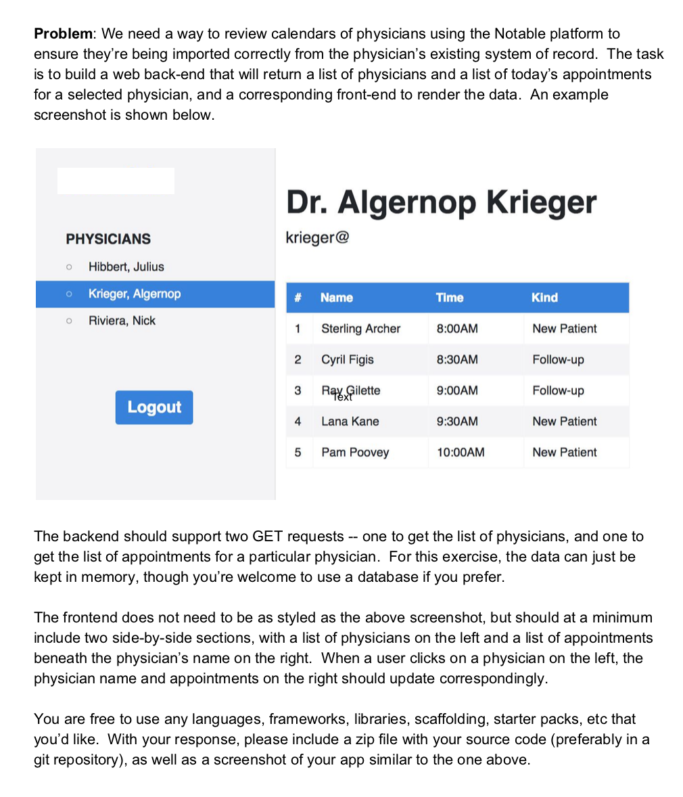

## Physicians Directory
Physicians Directory is a full stack webapp (FE, BE, DB) that displays physicians and their appointments. It has webpack setup to use proxy so that the React served by webpack-dev-server (localhost:3000) can still send requests to the backend server (localhost:8142)   




Created on May 2018.

### Features
#### More than just a Create React App
Physicians Directory has both a React front end served by webpack-dev-server as well as a Node/Express server that serves other APIs.

It is configured through webpack to serve both webpack-dev-server as well as defaulting to index.html
### Tech Stack
**Frontend:** 
React, served by the webpack-dev-server

**Backend:** 
Node/Express (port 8142)

**APIs:**
no external API used

**DB:**
represented as an exported JSON object (`db/appointments.js`, `db/physicians.js`)


### To Run:
`yarn install`
`npm start` (runs `webpack-dev-server --hot --port 3000`)
`node server/server.js`
open `localhost:3000`

### Frontend Architecture
**index.html**
loads the `js/app.js` and provides an app-root div
 
**app.js**
the App component, that wraps the `<Router>` component, which wraps the `<Home>` component
on componentDidMount, the server calls the backend for `api/physicians` and sets the physician state

### Backend Architecture
**server.js**
runs server on 8142. connects to the `db/*.js` files. you can `createNewAppointmentForPhysicianId`, `deleteAppointment` and get `appointmentsForPhysician`.

`GET /api/physicians`: returns a list of all physicians in the db
`GET /api/appointments/:physicianId`: returns a list of all appointments for physician in the db
`POST /api/appointments/:appointmentId/delete`: deletes an appointment
`POST /api/appointments/:physicianId/new`: creates new appointment for physicianId

**Webpack** 
is set up with a devServer. 
* Setting the `historyApiFallback` allows the `index.html` page to be served in place of any 404 responses. 
* Proxying some URLs can be useful when you have a separate API backend development server and you want to send API requests on the same domain. 
`webpack.config.js`
```
module.exports = {
 entry: { ... },
 output: { ... },
 devServer: {
    host: 'localhost',
    port: 3000,
    historyApiFallback: true, //allows you to load react in paths other than index
    proxy: {
      "/api": "http://localhost:8142"
    }
  },
```

### Improvements
- make the db changes persistent, by modifying the server/db files, using `fs` module
- update React styles into a .css file, instead of passing it as props.
- you can use arrow functions in React components now


